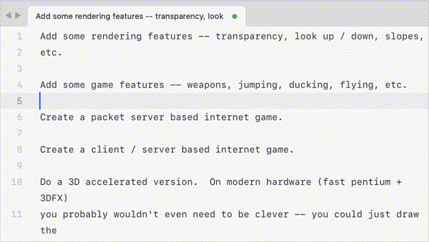

# /// SublimeFrame ///

[](https://opensource.org/licenses/MIT)

Add or remove ASCII frames around selected text in Sublime Text.

**Perfect starting point for your own Sublime Text plugins.**

This project demonstrates clean plugin architecture, text manipulation,<br>and keyboard shortcuts handling.

## Demo



The animation above demonstrates adding frames to text selections and removing them with a simple keyboard shortcut.

## Installation

Copy the plugin folder to your Sublime Text Packages directory:
- **macOS**: `~/Library/Application Support/Sublime Text 3/Packages/SublimeFrame`
- **Windows**: `%APPDATA%\Sublime Text 3\Packages\SublimeFrame`
- **Linux**: `~/.config/sublime-text-3/Packages/SublimeFrame`

## Usage

**Keyboard shortcut:**
- **macOS**: `Cmd+Shift+F`
- **Windows/Linux**: `Ctrl+Shift+F`

**Add frame:** Select text and press the shortcut
**Remove frame:** Place cursor inside frame (no selection) and press the shortcut

## Examples

Single line:
```
         ┌───────┐
         │ text  │
         └───────┘
```

Multiple lines:
```
┌─────────────────────┐
│ def hello():        │
│     print("Hello")  │
│     return True     │
└─────────────────────┘
```

## Features

- Smart action detection (add or remove based on context)
- Preserves text indentation
- Handles nested frames (removes outermost)
- Works with rectangular selections

## License

MIT License - see [LICENSE](LICENSE) file for details.

---

<p align="center">Built with ❤️ for the Sublime Text</p>